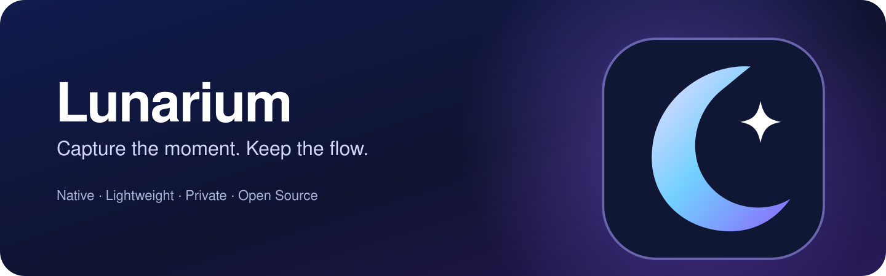

# Lunarium 🌙

**A fast, native, open-source screenshot and annotation tool for macOS.**

[](https://github.com/owlCoder/lunarium/actions/workflows/macos.yml)
[](LICENSE)
[](https://www.apple.com/macos/)
[](https://developer.apple.com/)

<p align="center"></p>

> **Development preview:** Lunarium is under active development. There is no notarized release yet. Follow the build instructions to test it on a Mac.

Lunarium is built for the workflow that makes Lightshot feel effortless: press a key, drag an area, annotate, and copy or save. Reimagined as a privacy-first macOS utility with a lightweight AppKit overlay and native screen capture.

## Features

- **One-key capture:** customizable global shortcut (default F13 / Print Screen on supported keyboards), plus permanent `⌘⇧2` fallback
- **Region selection:** drag to select, with on-screen dimensions and a focused editing toolbar
- **Annotations:** pen, arrows, lines, rectangles, ellipses, text, highlighter and undo; choose ink colors
- **Sensitive areas:** blur, pixelate and opaque solid-redaction tools (recommended when actual secrecy matters)
- **Export:** copy a PNG to the clipboard, or save a PNG file
- **Multiple displays:** captures each connected display using ScreenCaptureKit
- **Menu bar app:** stays out of the Dock, with optional launch at login
- **Languages:** English and Serbian Latin
- **Updates:** Sparkle-powered signed updates in properly configured Developer ID releases
- **Privacy:** no cloud service, analytics, sign-in, or screenshot uploads

> **Keyboard note:** macOS keyboards do not have a universal Print Screen virtual key. Many external keyboards map Print Screen to F13, but some require remapping. See [keyboard notes](docs/KEYBOARD.md).

## Requirements

- macOS 14 Sonoma or later
- Apple Silicon (arm64) Mac
- Xcode 16 or newer and [XcodeGen](https://github.com/yonaskolb/XcodeGen)
- Screen Recording permission (requested when capturing)

## Build from source

```bash
git clone https://github.com/owlCoder/lunarium.git
cd lunarium
brew install xcodegen
make project
open Lunarium.xcodeproj
```

Choose the **Lunarium** scheme, your local signing team if needed, and Run (⌘R). Or use `make build` for a command-line Debug build. Icon assets are generated locally from the included Swift vector drawing script. Sparkle is the sole non-Apple runtime dependency, used for signed updates.

**First launch:** Choose **Capture Area** from the menu bar. macOS may request Screen Recording permission. Grant it in **System Settings → Privacy & Security → Screen & System Audio Recording** and restart Lunarium if prompted. The hotkeys become available while the app is running.

## Use

1. Press **Print Screen / F13** or **⌘⇧2** (or use the menu bar icon).
2. Drag to select a region; press **Escape** to cancel.
3. Select a drawing tool, choose a color, blur/pixelate, or cover private data with opaque redaction.
4. Use **Copy** to paste a PNG, **Save** to write a PNG, or **Close** to dismiss. `⌘Z` undoes the most recent annotation.

## Architecture

```text
Lunarium/
  App/                  Menu bar lifecycle and settings
  Capture/              ScreenCaptureKit and global shortcuts
  Editor/               Multi-display overlay, annotations and image effects
  Services/             Clipboard and PNG export
  Resources/            App icon asset catalog
Brand/                  Source artwork (SVG)
scripts/                Native icon generator
docs/                   Contributor and keyboard notes
.github/workflows/      macOS CI and signed-release pipeline
project.yml             XcodeGen project definition
```

No Electron, embedded browser engine, telemetry, or screenshot upload service. Signed update checks use HTTPS through Sparkle. See [third-party notices](THIRD_PARTY_NOTICES.md).

## Roadmap

- [x] Native app architecture and menu bar workflow
- [x] Region capture, annotation, copy/save workflow (initial implementation)
- [x] User-configurable capture shortcut
- [x] Blur / pixelate, solid redaction, color palette and richer markup tools
- [x] Sparkle updater integration and gated Developer ID/notarization/DMG automation
- [ ] Provision Apple/Sparkle release secrets and verify a signed update round trip
- [x] English / Serbian Latin localization, unit tests and preferences UI smoke test
- [ ] Complete UI automation and manual permission/multimonitor hardware validation
- [ ] Public beta after hands-on macOS testing and successful signed release

Checked items mean committed implementations with automated compilation where available, **not** production-level validation. A real-device acceptance test and Apple signing credentials remain outstanding. See [test plan](docs/TESTING.md) and [release setup](docs/RELEASE_SETUP.md).

See [development notes](docs/DEVELOPMENT.md), [release process](docs/RELEASING.md), [localization](docs/LOCALIZATION.md) and [changelog](CHANGELOG.md) for project status and verification.

## Automated checks

Run `make test` for unit tests and `make ui-test` on an unlocked Mac for the Settings UI smoke test. Each push builds arm64 on GitHub Actions and retains an **unsigned, developer-only** ZIP artifact. A separately gated release workflow signs, notarizes and publishes stable tags when the maintainer provisions Apple credentials and Sparkle keys.

## Contributing

Issues and pull requests are welcome. Read [CONTRIBUTING.md](CONTRIBUTING.md) and [CODE_OF_CONDUCT.md](CODE_OF_CONDUCT.md). Please avoid sharing private screenshot contents in bug reports.

## Security & privacy

Lunarium captures screen pixels only when explicitly invoked and does not transmit screenshots. See [SECURITY.md](SECURITY.md) for responsible disclosure and [PRIVACY.md](PRIVACY.md) for the privacy statement.

## License

MIT © 2026 Lunarium contributors. See [LICENSE](LICENSE).

Lunarium is an independent open-source project, not affiliated with Lightshot or Apple.
