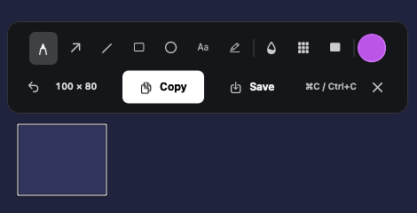

# Lunarium

**Native screenshots and annotations for macOS.** Capture a region, mark it up, and copy or save it without leaving your workflow.

[](https://github.com/owlCoder/lunarium/actions/workflows/macos.yml)
[](LICENSE)
[](https://github.com/owlCoder/lunarium/releases)
[](https://github.com/owlCoder/lunarium/releases)


[Download the preview](https://github.com/owlCoder/lunarium/releases/tag/v0.2.0-preview.1) · [Report a bug](https://github.com/owlCoder/lunarium/issues/new?template=bug_report.yml) · [Request a feature](https://github.com/owlCoder/lunarium/issues/new?template=feature_request.yml) · [Contribute](CONTRIBUTING.md)

## Features

- **Quick capture:** a customizable global shortcut, F13 by default, with a Command–Shift–2 fallback.
- **Focused editor:** a white selection outline, region dimensions, and a centered toolbar.
- **Markup:** pen, arrows, lines, rectangles, ellipses, text, highlighter, color selection, and undo.
- **Privacy tools:** blur, pixelate, and opaque redaction. Use opaque redaction to remove sensitive pixels from the exported image.
- **PNG export:** copy with Command–C or Control–C without saving a file, or choose a location with Save.
- **Native integration:** a menu bar app built with Swift, AppKit, SwiftUI, and ScreenCaptureKit; optional launch at login.
- **Multiple displays:** a capture overlay for each connected display.
- **Localization:** English and Serbian Latin.

Screenshots stay on your Mac. There are no accounts, analytics, or screenshot uploads. [Privacy details](PRIVACY.md).

<p align="center"></p>

*Actual AppKit interface rendered over a synthetic test image; no private screen content is shown.*

## Install

Requires **macOS 14 or later** on an **Apple Silicon Mac**. Intel builds are not currently distributed.

1. Download the arm64 DMG from [GitHub Releases](https://github.com/owlCoder/lunarium/releases).
2. Open the DMG and drag **Lunarium.app** into **Applications**.
3. Launch Lunarium and choose **Capture Area** from its moon icon in the menu bar.
4. Allow screen capture in **System Settings → Privacy & Security → Screen & System Audio Recording** (called **Screen Recording** on some macOS versions). Quit and reopen Lunarium if prompted.

**Preview status:** the current download is a development prerelease, ad-hoc signed and **not notarized** by Apple. macOS may block opening it because its developer cannot be verified. It is not a Developer ID release, and automatic updates are disabled. You can also [build from source](#build-from-source). See the release notes for checksums and known limitations.

## Use

Press the capture shortcut, drag a region, and choose a drawing or privacy tool. **Copy** puts the annotated PNG on the clipboard and closes the overlay; **Save** opens a file chooser. After copying, paste into the app you were using.

| Action | Shortcut |
| --- | --- |
| Start capture | F13, custom shortcut, or Command–Shift–2 |
| Copy PNG without saving | Command–C or Control–C |
| Undo an annotation | Command–Z |
| Cancel capture | Escape |

Configure the capture shortcut and launch-at-login preference in **Settings**. External keyboards often map Print Screen to F13; mappings vary. See [keyboard notes](docs/KEYBOARD.md).

## Build from source

Install Apple's Command Line Tools (`xcode-select --install`) or Xcode, and [XcodeGen](https://github.com/yonaskolb/XcodeGen). The local build supports Apple Silicon and verifies the pinned Sparkle download with SHA-256.

```bash
git clone https://github.com/owlCoder/lunarium.git
cd lunarium
brew install xcodegen
make local-build
open .build/local/Lunarium.app
```

To create an optimized local build and a development DMG:

```bash
make dmg
# App: .build/local-release/Lunarium.app
# DMG and checksum: .build/dist/
```

Local builds use ad-hoc signing. Rebuilding can require reapproving Screen Recording permission; see [development notes](docs/DEVELOPMENT.md#screen-recording-permission-after-rebuilding).

For Xcode development and XCTest, install **Xcode 16 or newer**:

```bash
make project
open Lunarium.xcodeproj
make build
make test
make ui-test  # Requires an unlocked, interactive Mac
```

XcodeGen generates the project and icon assets from checked-in sources. Sparkle 2.9.6 is the only non-Apple runtime dependency. [Third-party notices](THIRD_PARTY_NOTICES.md).

## Project status

Lunarium is actively developed. The preview includes capture, annotations, privacy tools, clipboard export, and local PNG saving. Signed, notarized distribution and the complete hardware acceptance matrix remain release milestones.

GitHub Actions builds the arm64 app and runs unit tests on pushes and pull requests. UI tests use a Debug-only synthetic capture fixture; real Screen Recording permissions and mixed-scale displays require manual testing. The [test plan](docs/TESTING.md) records the scope of these checks.

Developer ID releases have a separate gated workflow for notarization and Sparkle update signing. The preview is distributed independently of that workflow. See [release setup](docs/RELEASE_SETUP.md), [release process](docs/RELEASING.md), and [changelog](CHANGELOG.md).

## Contributing

Bug reports, focused pull requests, accessibility improvements, and translations are welcome. Read [CONTRIBUTING.md](CONTRIBUTING.md) for setup and review expectations, and follow the [Code of Conduct](CODE_OF_CONDUCT.md).

Please remove private information from screenshots and logs. Report vulnerabilities privately through [GitHub's security reporting page](https://github.com/owlCoder/lunarium/security/advisories/new); see [SECURITY.md](SECURITY.md).

## License

[MIT](LICENSE) © 2026 Lunarium contributors. Lunarium is an independent open-source project.
